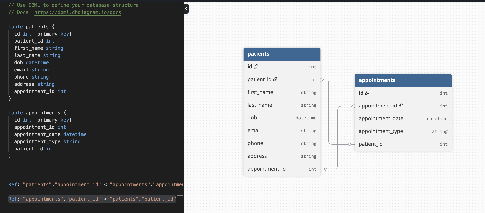

# vynca_takehome

## Setup Instructions
### Setting Up the Backend 
This FastAPI backend uses Pipenv virtual environment for dependency management and requires and python3 pipenv to install

1. Install dependencies with Pipenv and activate environment in the project root

    `pipenv install --dev`

    `pipenv shell`

2. Navigate to the backend folder and start the server
    `uvicorn main:app --reload -port 8000`

### Setting Up the Frontend 

1. Navigate to frontend folder and install dependencies

    `npm install`

2. Navigate to the backend folder and start the server
    `npm start`

### Seeding Demo Data

Click "Load Demo Data" button on the "/" page

## Schema

From the provided .txt file, the data was broken down into two relational tables: Patients and Appointments

SQLModel was used as it is the example used in the FastAPI docs for SQL database modeling. It is built on top of Pydantic and SQLAlchemy for validation.
### Patients
Each patient detail includes a first name, last name, dob, email, phone, address, and an appointment_id that corresponds to an appointment date and an appointment type.

Each patient can have multiple appointments or no appointments.
### Appointments
Appointments were identified by an appointment_id. Appointments without an id were removed from the table.

Appointments may or may not have a date or a type.
Patient_id was added to the appointments table as a foriegn key to link the appointment back to a patient. Patient_id tracks the patient–appointment relationship, and relational mapping happens through patient_id.

`patient_id: int | None = Field(default=None, foreign_key="patient.patient_id")`

`appointments: List[AppointmentModel] = Relationship(back_populates="patient") `
### Data Validation Choices for Demo Data
Pandas is a common data analysis and manipulation python library that as used for cleaning data 

Patients without a first name or last name were included  as long as they had a valid patient_id because of real life instances of data input error/missing patient name data. Names were normalized by capitalizing the strings;

All patients had a valid DOB. Due to different ways DOB was entered, pandas was used to normalize to a datetime.

Patient phone numbers, emails, and addresses were allowed to be null due to real-life variation in patient contact methods. Data was normalized with pandas by replacing string "at" with @, and extracting all digits from the given phone number string. Invalid emails and numbers were removed from data by checking against regex expressions 

Appointments without a valid appointment_id were removed from the displayed data. Appointments with a valid appointment_id were displayed even if they did not have a valid date or consult type to maximize patient appointment data.

Appointment dates were similarly normalized as patient DOB.

Appointment types were normalized by capitalizing the string in case of variation of data entry, for future consideration of analyzing data by type.

## Examples of Future Considerations
Regarding data validation, depending on stakeholder needs, data validation can become stricter by removing all patient data with empty or null values for name and dob, and/or removing patients that do not have any valid form of contact method. Similarly, appointments without a date and/or type can be removed.

The frontend should also include an option to upload a .txt or .csv file to intake non-demo data

Frontend can also include search or filter options for patients

## Resources Used
#### FastAPI YouTube tutorial: https://www.youtube.com/watch?v=iWS9ogMPOI0
#### DBDiagram: https://dbdiagram.io/d
#### FastAPI official docs: https://fastapi.tiangolo.com
#### FastAPI TestClient: https://dev.to/kfir-g/why-you-should-use-a-single-fastapi-app-and-testclient-instance-4m2b
#### Pydantic: https://docs.pydantic.dev/latest/api/base_model/#pydantic.create_model
#### SQLModel: https://sqlmodel.tiangolo.com/
#### Using Pandas for converting txt to csv: https://codingbanana.medium.com/convert-your-text-file-into-csv-using-python-d346c8ae7952
#### Clean Up with Pandas: https://stackoverflow.com/questions/69238115/how-to-remove-extra-column-with-no-header-in-csv-in-python
https://www.w3schools.com/python/pandas/pandas_cleaning_wrong_format.asp
#### Data cleanup: https://medium.com/@rgr5882/100-days-of-data-science-day-37-using-regular-expressions-for-data-cleaning-809ab09a4958
https://stackoverflow.com/questions/78485326/pandas-extract-phone-number-if-it-is-in-correct-format/78485400
#### SQLModel: https://github.com/tiangolo/sqlmodel/issues/215
#### Strawberry GraphQL: https://strawberry.rocks/docs/concepts/typings
#### Lazy Loading: https://docs.sqlalchemy.org/en/14/orm/loading_relationships.html
#### Apollo Docs: https://www.apollographql.com/docs/react/get-started
#### MUI Docs: https://mui.com/material-ui/getting-started/
#### Phone number validation: https://stackabuse.com/validating-and-formatting-phone-numbers-in-python/
https://stackoverflow.com/questions/2703322/regular-expression-to-match-10-14-digits
